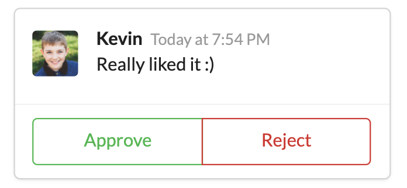
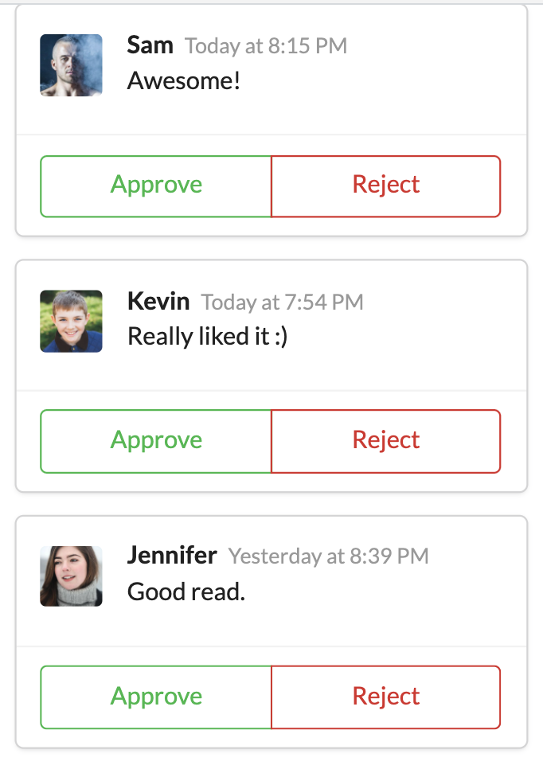

# Comment Section Component

## What is it ?

* This is a simple React project which shows a list of comments in a blog.
* The UI consists of a comment box, inside which at the very top is - the avatar, username, timestamp, & the user's message. 
* At the bottom of the box, a couple of buttons are present for Approve & Reject. 
* Used the concept of Component Resuse & Component Nesting to utilise the components effectively.
* Also understood the concept of props & how to pass a component(in my case: CommentDetail) inside props.
* It uses the Semantic-UI for the styling purposes. Also uses [Pravatar](https://pravatar.cc) for generating random avatars.

## App Screenshots

 |  (Comment Box) |  (List of Comments) |
 |:---:|:---:|
